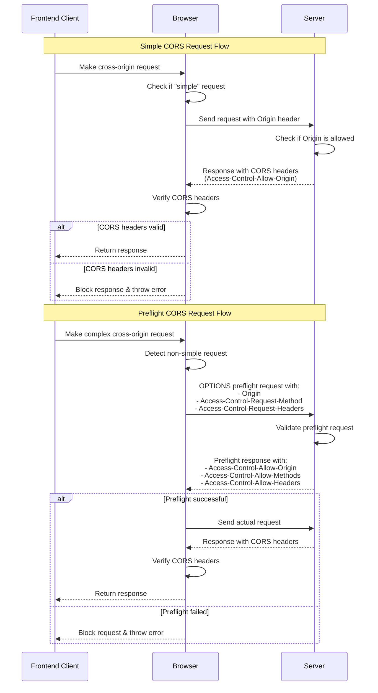

# Cross-Origin Resource Sharing (CORS)

If you are a web developer then you might have come across the CORS error like the one below while trying to fetch some data from an API from you local environment or sometimes even from a deployed website
```
Cross-Origin Request Blocked: The Same Origin Policy disallows
reading the remote resource at https://some-url.com (Reason:
additional information here).
```

## Agenda

1. [Same-Origin Policy](#same-origin-policy)
2. [Understanding CORS](#understanding-cors)
3. [CORS Headers](#cors-headers)
4. [CORS Requests](#cors-requests)
5. [Security Implications](#security-implications)
6. [Best Practices](#best-practices)


## Same-Origin Policy

The Same-Origin Policy (SOP) is a critical security mechanism implemented by web browsers that restricts how a document or script loaded from one origin can interact with resources from other origins.

### What is the purpose of Same-Origin Policy

- To protect users and their data from malicious actions and security vulnerabilities, like cross-site scripting (XSS) or cross-site request forgery (CSRF).
- Imagine you are logged into your bank account at `https://mybank.com`, and you’re browsing the web at the same time. Without the Same-Origin Policy, a malicious website you visit (say `https://evilsite.com`) could execute JavaScript that tries to steal your bank account details from `https://mybank.com`. For example, the malicious script could try to read cookies or make requests to the bank’s server to withdraw money, all without your consent.

### What constitutes "Same Origin"?

An origin consists of three parts:

-   Protocol (http/https)
-   Domain/hostname
-   Port number

For example:

-   `https://example.com:443/path` and `https://example.com:443/other-path` are same origin
-   `https://example.com` and `http://example.com` are different origins (different protocol)
-   `https://example.com` and `https://api.example.com` are different origins (different domain)
-   `https://example.com` and `https://example.com:8080` are different origins (different port)

## Understanding CORS

CORS is a mechanism that allows servers to specify which origins are permitted to read that information from a web browser. It extends and adds flexibility to the Same-Origin Policy.

### When is CORS needed?

CORS is required when:

1. Making XMLHttpRequest or Fetch API calls to a different domain
2. Web Fonts (for cross-domain font usage)
3. Loading static assets like images/videos/stylesheet from a CDN served on a different origin

## CORS Headers

### Key Response Headers

1. `Access-Control-Allow-Origin`

    - Specifies which origins can access the resource
    - Examples:
        ```
        Access-Control-Allow-Origin: *
        Access-Control-Allow-Origin: https://trusted-site.com
        ```

2. `Access-Control-Allow-Methods`

    - Specifies allowed HTTP methods
    - Example:
        ```
        Access-Control-Allow-Methods: GET, POST, PUT, DELETE, OPTIONS
        ```

3. `Access-Control-Allow-Headers`

    - Indicates which HTTP headers can be used
    - Example:
        ```
        Access-Control-Allow-Headers: Content-Type, Authorization
        ```

4. `Access-Control-Allow-Credentials`
    - Controls if credentials (cookies, authorization headers) can be sent
    - Example:
        ```
        Access-Control-Allow-Credentials: true
        ```

## CORS Requests

### Simple Requests

Simple requests don't trigger a preflight and must meet all the following conditions:

-   Methods: GET, HEAD, or POST
-   Headers: Only allowed headers are:
    -   Accept
    -   Accept-Language
    -   Content-Language
    -   Content-Type (limited to the following values)
        -   application/x-www-form-urlencoded
        -   multipart/form-data
        -   text/plain

### Preflight Requests

For requests that don't meet the "simple" criteria, browsers send a preflight OPTIONS request:

1. Browser sends OPTIONS request with:

    - Origin header
    - Access-Control-Request-Method
    - Access-Control-Request-Headers

2. Server responds with:
    - Access-Control-Allow-Origin
    - Access-Control-Allow-Methods
    - Access-Control-Allow-Headers
    - Access-Control-Max-Age

## CORS request flow



## Security Implications

### Risks of Misconfigured CORS

1. **Too Permissive Settings**

    - Using `Access-Control-Allow-Origin: *`
    - Allowing all headers and methods

2. **Information Disclosure**

    - Sensitive data exposure to unauthorized origins
    - Credential exposure through misconfigured settings

3. **Security Header Bypass**
    - Bypassing CSRF protection
    - Circumventing content security policies

## Best Practices

### Implementing Secure CORS

1. **Specific Origin Allow-listing**

    ```javascript
    const allowedOrigins = [
        'https://trusted-site.com',
        'https://admin.trusted-site.com',
    ]
    app.use((req, res, next) => {
        const origin = req.headers.origin
        if (allowedOrigins.includes(origin)) {
            res.setHeader('Access-Control-Allow-Origin', origin)
        }
        next()
    })
    ```

2. **Minimal Access**

    - Only allow necessary HTTP methods
    - Restrict allowed headers
    - Limit exposed headers

3. **Careful Credential Handling**

    ```javascript
    // Only if cross-origin requests need credentials
    res.setHeader('Access-Control-Allow-Credentials', 'true')
    // Must specify exact origin when allowing credentials
    res.setHeader('Access-Control-Allow-Origin', 'https://trusted-site.com')
    ```

4. **Validate Origins**
    - Implement proper origin validation
    - Use environment-specific configurations
    - Regular audit of allowed origins
