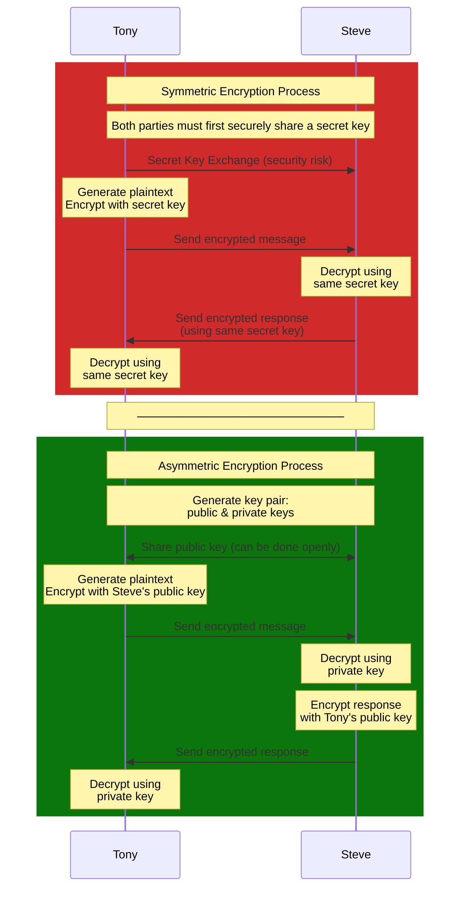

# Encoding, Encryption & Hashing

## Agenda

1. [Encoding](#encoding)
2. [Encryption](#encryption)
3. [Hashing](#hashing)
4. [Comparison](#comparison)

## Encoding

Encoding is a process of converting data from one format to another using a publicly available scheme.
Encoding is used to ensure data is correctly consumed by different systems. It's reversible and doesn't require any secret key. _**It's designed for data compatibility**_.

### Use Cases

1. **Unicode Encoding** 

    - Supporting multilingual applications and ensuring proper character display across different systems
    
    ```
    Japanese "こんにちは" → U+3053 U+3093 U+306B U+3061 U+306F
    ```


2. **Binary to text encoding**

    - Embedding binary data in JSON, storing binary data in databases that only support text

    ```python
    # Image attachment in email
    Image bytes → "iVBORw0KGgoAAAANSUhEUgAAA..."

    # Data URIs in HTML/CSS
    
    ```


3. **URL Encoding**

    - Encoding special characters in URLs to ensure proper transmission

    ```
    Space becomes %20
    + becomes %2B

    Original URL: https://example.com/search?query=hello world&type=all
    Encoded URL: https://example.com/search?query=hello%20world&type=all
    ```

4. **QR Codes**

    - Encoding data in QR codes for easy scanning and retrieval

    ```
    https://example.com → [QR Code Pattern]
    ```

5. **Data Format Encoding**

    - JSON, XML, CSV, etc., for data interchange between systems

    ```json
    {
    "name": "John \"Johnny\" Smith",
    "description": "Line 1\nLine 2"
    }
    ```

### Common Encoding Schemes

- UTF-8 for general text handling
- Base64 for binary data in text systems
- URL encoding for web addresses
- HTML entities for web content

## Encryption

Encryption is a security process that converts readable data (plaintext) into an unreadable format (ciphertext) using an algorithm and a key. _**It's designed for confidentiality**_.

### Types of Encryption

1. **Symmetric Encryption**

    - Same key for encryption and decryption
    - Faster but key distribution is challenging

2. **Asymmetric Encryption**
    - Public key for encryption
    - Private key for decryption
    - Slower but better key distribution

### Encryption flow



### Use Cases

1. **Secure Communication**

    - Allows secure message exchange between parties
    - HTTPS, VPNs, secure messaging apps
    - Best for: Client-server communication, API security

2. **File Encryption**

    - Uses AES-256-GCM for secure file encryption
    - Includes authentication tag for integrity
    - Handles binary data securely

3. **Digital Signatures**

    - Verifying the authenticity of data

4. **Auth Token Encryption**

    - Creates and verifies encrypted JWT tokens
    - Best for: Session management, API authentication

### Common Algorithms

-   AES (Symmetric)
-   RSA (Asymmetric)
-   ChaCha20 (Symmetric)
-   ECC (Asymmetric)

### Best Practices

- Secure key storage
- Regular key rotation
- Use standard algorithms by following industry recommendations
- Avoid deprecated algorithms
- User initialization vectors (IVs)

## Hashing

Hashing is a one-way function that converts input data of any size into a fixed-size output. _**It's designed for integrity checking**_ and cannot be reversed.

### Use Cases

1. **Password Storage**

    - Securely store passwords in databases
    - Protects against data breaches

2. **Data Integrity Verification**

    - Verify data integrity during transmission
    - Ensure data hasn't been tampered with
    - Best for: File checksums, digital signatures

3. **Data Deduplication**

    - Identify duplicate data without storing the original data
    - Best for: caching

4. **Blockchain**

    - Hashing is used to create blocks in blockchain
    - Ensures data integrity and immutability

### Common Algorithms

1. **General Purpose**

    - SHA-256, SHA-512
    - Blake2, Blake3

2. **Password Hashing**
    - Argon2
    - bcrypt
    - PBKDF2

## Comparison

| Feature          | Encoding                                                                 | Encryption                                                    | Hashing                                                        |
| ---------------- | ------------------------------------------------------------------------ | ------------------------------------------------------------- | -------------------------------------------------------------- |
| **Purpose**      | Data compatibility                                                | Data confidentiality                                          | Data integrity & verification                                  |
| **Reversible**   | Yes (easily)                                                             | Yes (with key)                                                | No                                                             |
| **Key Required** | No                                                                       | Yes                                                           | No                                                             |
| **Output**       | Variable length                                                          | Variable length                                               | Fixed length                                                   |
| **Security Use** | None (not for security)                                                  | Protecting data confidentiality                               | Password storage, data integrity                               |
| **Common Uses**  | - Binary to text conversion<br>- URL-safe strings<br>- Data transmission | - Secure communication<br>- Data storage<br>- File protection | - Password storage<br>- File checksums<br>- Digital signatures |
| **Examples**     | - Base64<br>- URL encoding<br>- ASCII                                    | - AES<br>- RSA<br>- ChaCha20                                  | - SHA-256<br>- bcrypt<br>- Argon2                              |
| **Performance**  | Fast                                                                     | Moderate to Slow                                              | Fast to Moderate                                               |
| **Use When**     | Need to represent data in a different format                             | Need to keep data secret and retrieve it later                | Need to verify data integrity or store passwords               |
